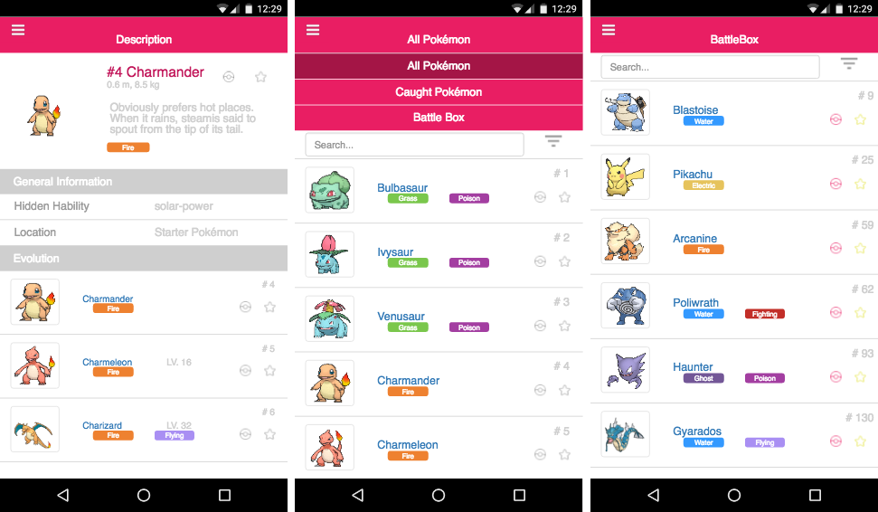

# Code Challenge3- Nestor Ayala ~ Ver. 0.5

## Description

Pokédex App developed using AngularJs.

## To do:

* Unit tests
* Finish Nav. Bar ~
* Small [Description] tweaks
* Small less tweaks

### Build & development

Run `grunt` for building and `grunt serve` for preview.

### Testing

Running `grunt test` will run the unit tests with karma.
